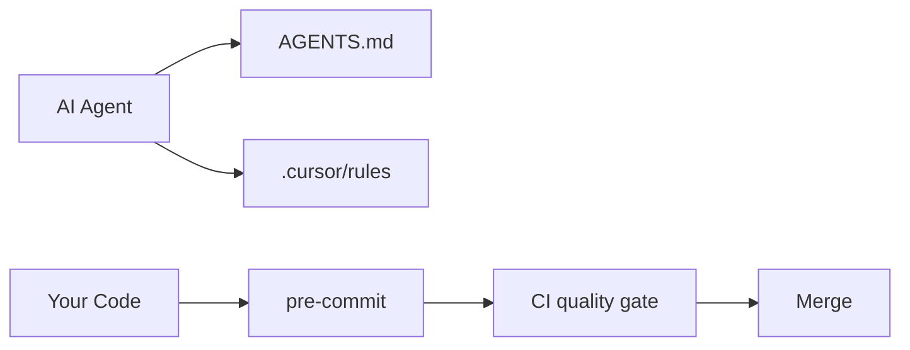

# Anti-AI-Bloat Guardrails Playbook

Reusable system for keeping AI-assisted code simple, on-scope, and jargon-free across any project.

**Version:** 1.0.0 · **Updated:** 2026-08-04

**Related:** Per-project copy: `docs/ai-guardrails.md`

---

## Quick start (new project)

1. Read this playbook once.
2. Run the [implementation checklist](#implementation-checklist).
3. Fill project-specific sections in that repo's `AGENTS.md`.
4. Keep this playbook generic — project details stay in the repo.

```bash
# Minimum bootstrap (Python projects; adapt for other stacks)
ln -s AGENTS.md CLAUDE.md && ln -s AGENTS.md GEMINI.md
pip install ruff pytest pre-commit codediet detect-secrets
pre-commit install
```

---

## The problem

AI coding agents are trained to look **comprehensive**, not **minimal**. Without guardrails, repos accumulate:

- Abstract base classes for one implementation
- `utils/` modules that grow forever
- Features you never asked for
- Drive-by refactors in unrelated files
- Plausible code that was never run

Prompts alone do not fix this. You need **behavioral rules** plus **mechanical gates**.

---

## Three-layer architecture

| Layer | Role | Artifacts | When it runs |
|-------|------|-----------|--------------|
| **1. Behavioral** | Tell agents how to act | `AGENTS.md`, `.cursor/rules/*.mdc`, optional skill | Every session |
| **2. Local mechanical** | Catch bloat before commit | pre-commit, linter, CodeDiet | `git commit` |
| **3. CI mechanical** | Catch what slipped through | GitHub Actions, PR template | Pull request |



---

## Layer 1: Behavioral rules

### AGENTS.md (source of truth)

Copy structure from [FerroxLabs/agents-md](https://github.com/FerroxLabs/agents-md). Keep under **300 lines**.

**Required sections:**

| Section | Content |
|---------|---------|
| Non-negotiables | No flattery, disagree when wrong, surgical diffs, no fabrication |
| Before writing code | Read files, state plan, surface assumptions |
| Simplicity first | Minimum code, no speculative abstractions |
| Surgical changes | Every line traces to the request |
| Goal-driven execution | Verifiable success criteria, run checks |
| Project context | Stack, commands, layout, **forbidden scope** |
| Project Learnings | Living list of corrections (3-strike rule) |

**Cross-tool portability:**

```bash
ln -s AGENTS.md CLAUDE.md
ln -s AGENTS.md GEMINI.md
```

### Cursor rules (`.cursor/rules/*.mdc`)

Split by concern. **One file, one job. Under 50 lines each.**

| File pattern | `alwaysApply` | Purpose |
|--------------|---------------|---------|
| `00-core-simplicity.mdc` | `true` | Karpathy 4 principles, banned jargon, plain naming |
| `10-[primary-stack].mdc` | globs | Language/framework conventions |
| `20-[secondary-stack].mdc` | globs | Frontend, mobile, etc. |
| `90-pr-review-gate.mdc` | `false` | Manual pre-PR checklist |

**Example frontmatter:**

```yaml
---
description: Core simplicity rules for all work
alwaysApply: true
---
```

**Karpathy 4 (encode in `00-core-simplicity.mdc`):**

1. **Think before coding** — assumptions explicit, ask when ambiguous
2. **Simplicity first** — minimum code, nothing speculative
3. **Surgical changes** — touch only what the request requires
4. **Goal-driven** — verifiable success criteria, run before claiming done

### Simplicity review skill

Path: `.cursor/skills/simplicity-review/SKILL.md`

Invoke explicitly before PRs: `@simplicity-review`

Output must name smells using [AgentPatterns](https://agentpatterns.ai/patterns/anti-patterns/) terms and give SHIP / SIMPLIFY FIRST verdict.

Set `disable-model-invocation: true` so it only runs when called.

---

## Layer 2: Local mechanical gates

### Linter (stack-specific)

**Python (Ruff) — suggested rules:**

```toml
[tool.ruff.lint]
select = ["E", "F", "I", "C901", "PLR0915", "ERA001"]

[tool.ruff.lint.mccabe]
max-complexity = 10

[tool.ruff.lint.pylint]
max-statements = 50
```

**JavaScript/TypeScript:** ESLint complexity rules, `@typescript-eslint/no-unused-vars`, Biome or Prettier for format.

### pre-commit

Minimum hooks:

| Hook | Purpose |
|------|---------|
| Linter + formatter | Style and basic errors |
| detect-secrets | AI repos often leak example keys |
| CodeDiet | Structural bloat (Python) |

Start CodeDiet as **warn-only** until you have a baseline. Fail in CI once code exists.

### CodeDiet

Detects AI-specific bloat other linters miss:

- Pass-through wrapper functions
- Duplicate helpers (`_v2`, `_final`)
- Sprawling `utils.py` files

```bash
pip install codediet
codediet scan src/   # or backend/, app/, etc.
```

---

## Layer 3: CI and PR process

### GitHub Actions skeleton

- Lint
- Test
- CodeDiet (when applicable)
- Diff size warning (>400 lines → suggest split)

Use `continue-on-error: true` on empty/greenfield repos. Remove once real code lands.

### PR template checklist

```markdown
- [ ] Every changed line maps to the stated task
- [ ] No new abstractions without 2+ concrete use cases today
- [ ] No unrequested features (list any: ___)
- [ ] Tests run and pass locally
- [ ] AGENTS.md Project Learnings updated if repeatable mistake
```

---

## Banned patterns (with examples)

### Abstraction bloat

```python
# BAD
class BaseHandler(ABC):
    @abstractmethod
    def handle(self): ...

class EmailHandler(BaseHandler): ...

# GOOD
def send_email(to: str, body: str) -> None: ...
```

**Rule:** No ABC/base class/factory unless **2+ implementations exist today**.

### Utils sprawl

```python
# BAD — helpers/helpers.py with 40 unrelated functions
# GOOD — helper next to the only caller
```

### Unrequested features

Request: "add email notification"

AI adds: rate limiter, analytics, webhook system, retry policy

**Rule:** If not in the request or spec, do not build it.

### AI jargon (code and chat)

Ban in code/comments: robust, comprehensive, leverage, utilize, ensure seamless, orchestrate, harness

Ban in agent chat: flattery openers, "As an AI...", ceremonial closings

Use plain names: `save_user` not `UserPersistenceOrchestrationService`

---

## Research and source library

| Source | Use for |
|--------|---------|
| [agents.md](https://agents.md/) | Cross-tool agent instruction format |
| [FerroxLabs/agents-md](https://github.com/FerroxLabs/agents-md) | Behavioral rule boilerplate |
| [Karpathy skills](https://github.com/multica-ai/andrej-karpathy-skills) | Four core principles |
| [AgentPatterns anti-patterns](https://agentpatterns.ai/patterns/anti-patterns/) | Named smells for reviews |
| [CodeDiet](https://pypi.org/project/codediet/) | Bloat detection |
| [Fowler: design-first AI](https://martinfowler.com/articles/reduce-friction-ai/design-first-collaboration.html) | Gate implementation behind design approval |
| [arxiv: AI-Generated Smells (2026)](https://arxiv.org/html/2605.02741) | Research on architectural decay |
| [Cursor rules guide](https://trinitytuts.com/cursor-rules-explained-complete-cursorrules-guide-2026) | `.mdc` format and size limits |

---

## Maintenance

### 3-strike rule

Same correction **3 times in one week** → add one concrete line to AGENTS.md **Project Learnings**:

- Good: `Always use plain functions in collectors/ — no BaseCollector ABC`
- Bad: `Be careful about over-abstraction`

### Monthly prune

For each rule line: *"Would removing this cause a mistake?"* If no → delete.

### Size ceilings

| Artifact | Max size |
|----------|----------|
| AGENTS.md | 300 lines |
| Always-on `.mdc` | 50 lines |
| Stack-specific `.mdc` | 80 lines |
| This playbook | Update in place; don't duplicate into every repo |

### Phase gates

Before starting a new roadmap phase, re-read the **forbidden / out of scope** list in AGENTS.md. AI routinely builds Phase N+2 during Phase 1.

---

## Implementation checklist

Copy into each new project:

- [ ] `AGENTS.md` from FerroxLabs template + project context filled in
- [ ] `CLAUDE.md` / `GEMINI.md` symlinks
- [ ] `.cursor/rules/00-core-simplicity.mdc` (always on)
- [ ] `.cursor/rules/10-*.mdc` for primary stack (globs)
- [ ] `.cursor/rules/20-*.mdc` for secondary stack if needed
- [ ] `.cursor/rules/90-pr-review-gate.mdc` (manual)
- [ ] `.cursor/skills/simplicity-review/SKILL.md`
- [ ] Linter config for stack
- [ ] `.pre-commit-config.yaml`
- [ ] `.secrets.baseline` (if using detect-secrets)
- [ ] `.github/workflows/quality-gate.yml`
- [ ] `.github/pull_request_template.md`
- [ ] `docs/ai-guardrails.md` (project-local; links here + lists project specifics)
- [ ] After first real code: remove CI `continue-on-error`, enable CodeDiet fail

---

## Per-project doc template

Create `docs/ai-guardrails.md` in each repo:

```markdown
# AI Guardrails — [PROJECT NAME]

Global playbook: https://github.com/pbhargesh82/ai-guradrails/blob/main/anti-ai-bloat-guardrails-playbook.md

## This project's specifics

- **Stack:** ...
- **Source dirs:** ...
- **Forbidden (out of scope):** ...
- **Commands:** install / test / lint / run

## Local files

- AGENTS.md, .cursor/rules/, simplicity-review skill
- CI: .github/workflows/quality-gate.yml
```

---

## What NOT to do

- One 800-line `.cursorrules` file
- Copying every source verbatim into AGENTS.md
- Fail-hard CI before any source code exists
- Banning all abstractions (shared types with 2+ uses are fine)
- Putting project-specific details in this playbook

---

## Changelog

| Version | Date | Changes |
|---------|------|---------|
| 1.0.0 | 2026-08-04 | Initial playbook extracted from first project implementation |

---

## Future updates (your notes)

Add entries here as you refine across projects:

| Date | Update | Learned from |
|------|--------|--------------|
| | | |

**Backlog ideas:**

- [ ] Global Cursor user rule mirroring `00-core-simplicity`
- [ ] Rule pack templates for Go, Rust, mobile
- [ ] Pre-commit hook blocking PRs over N lines without label
- [ ] Monthly prune reminder
